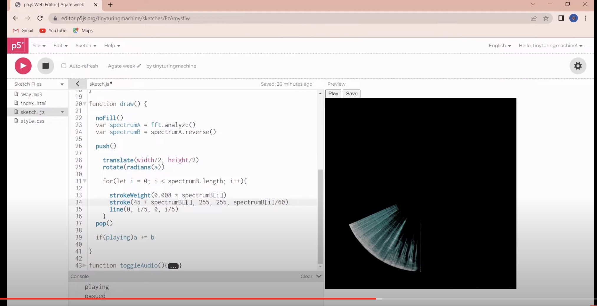
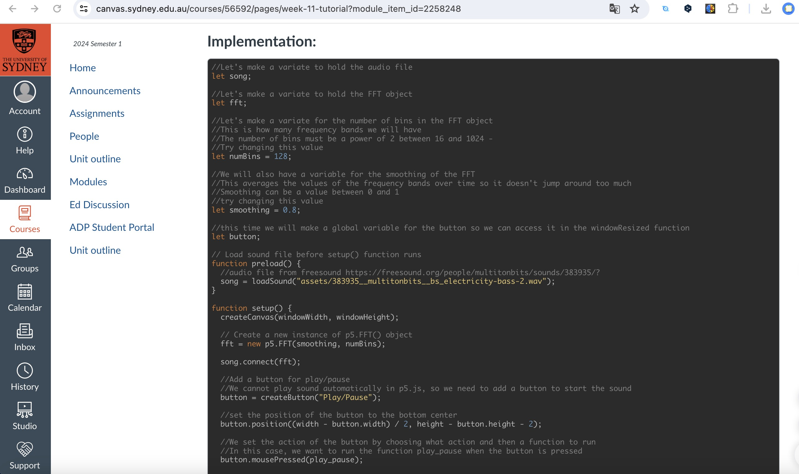
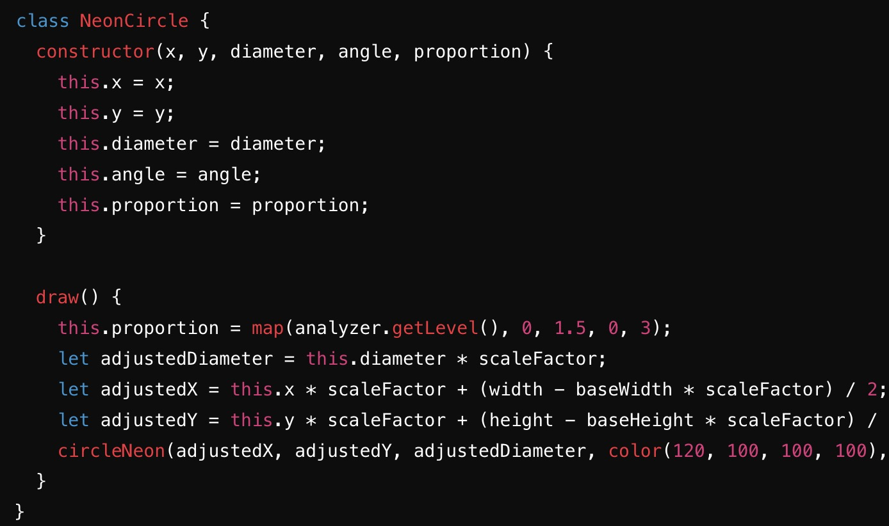
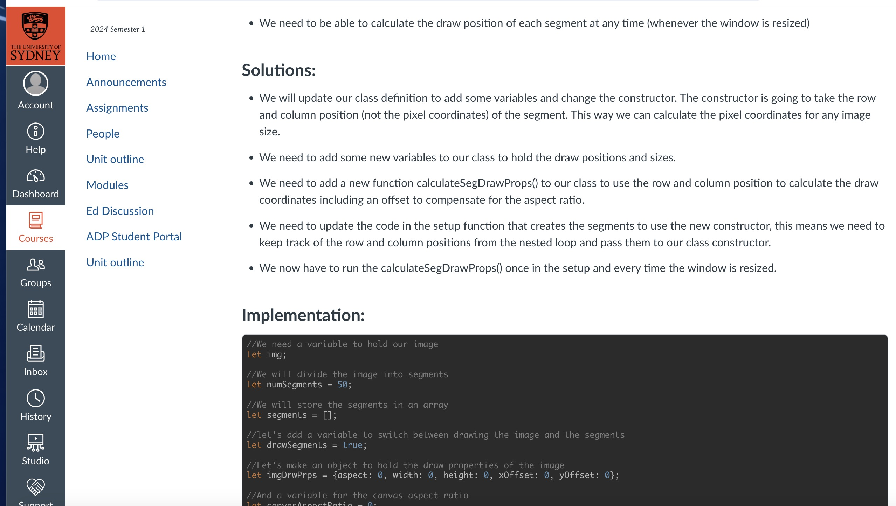

# zwan0233_9103_major-project

## 1.Instructions on how to interact with the work

Click the Start play button below the work, and the animation will be played. If you want to pause it just click again and the animation will be paused. The main effect of the animation is that the apple tree fruit will change the proportion of green and red according to the size of the audio to achieve a stunning visual effect

## 2.Details of my individual approach to animating the group code

I choose to use audio to drive my personal code. The animation direction I chose in my personal code was to change the colours to make sure I worked differently from group to group

## 3.References to inspiration for animating my individual code

(https://www.youtube.com/watch?v=8B3GzZo-z9A)

The code in this video talks about the visualisation of music aimed at drawing circles through audio. This one inspired me and the artwork our group chose was an apple tree. In the apple tree, there is a line in the middle of the fruit to differentiate between green and red. This is very similar to the line in the video. I wanted to make the apple tree come alive by changing the size of the green and red colours through the audio.

## 4.A short technical explanation of how my individual code works to animate the image and any appropriate references.

(https://canvas.sydney.edu.au/courses/56592/pages/week-11-tutorial?module_item_id=2258248)

I will make small changes to what I learnt in week 11's tut. Firstly I learnt in week 11 tut to preload the audio file to make sure it is fully loaded before attempting to play it and will add play/pause buttons to control the sound playback. The spectrum of the audio file was then analysed and visualised using the technique Fast Fourier Transform (FFT). This helps to represent the distribution of different frequencies in the music. Finally, the audio spectrum analysed by the FFT correlates with the promotion in the circle function to achieve an apple that changes colour in response to the audio (this is a little different from the tut in week 11 but similar in principle).

## 4.1.A short technical explanation of how my individual code works to animate the image and any appropriate references.

(code in the group)

(code in the wee8 tut)

Regarding how to adjust my work to be able to adapt to the resizing of the browser window, I combined the principles of the functions taught by tut in week 8 with the new techniques used in the group code. By combining these two codes I was able to achieve a resizing of my work to fit the browser window. I will explain this below.

First I define baseWidth and baseHeight, which represent the initial size of the canvas and are used to calculate the scale. In the calculateScaleFactor function, the scaleX and scaleY are calculated horizontally and vertically based on the width and height of the current window, and the smallest value is used as the scaleFactor, which ensures that the graphic doesn't change when scaled horizontally or vertically. In the draw of each graphic class, the position and size of the graphic are adjusted according to the scaleFactor. The size and coordinates are scaled by multiplying the scaleFactor, and the graphic is centred by calculating the offsets (width - baseWidth * scaleFactor) / 2 and (height - baseHeight * scaleFactor) / 2. Adaptation of the artwork to the browser window's size is achieved by calculating the scale or aspect ratio in Figure 4 and multiplying the scale in Figure 3.  Because the principles are similar it's just a matter of combining them.

